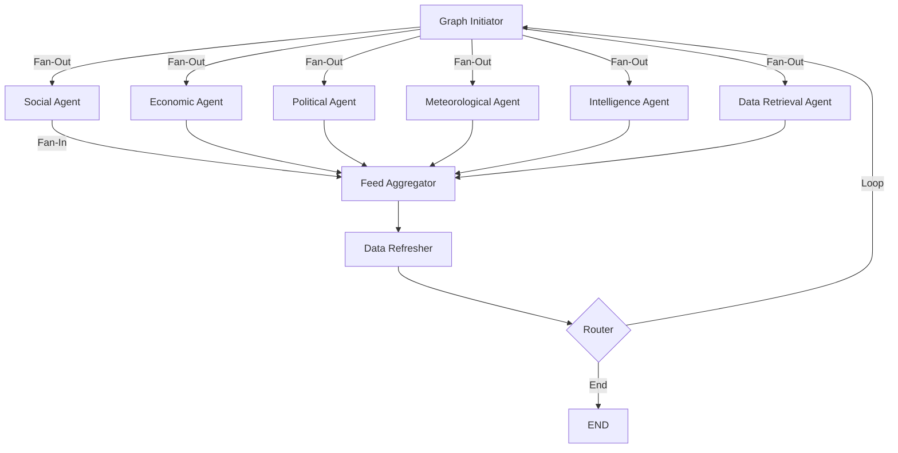

# 🇱🇰 Roger Intelligence Platform

**Real-Time Situational Awareness for Sri Lanka**

A multi-agent AI system that aggregates intelligence from 47+ data sources to provide risk analysis and opportunity detection for businesses operating in Sri Lanka.

## 🌐 Live Demo

| Component | URL |
|-----------|-----|
| **Frontend Dashboard** | [https://model-x-frontend-snowy.vercel.app/](https://model-x-frontend-snowy.vercel.app/) |
| **Backend API** | [https://nivakaran-Roger.hf.space](https://nivakaran-Roger.hf.space) |

---

## 🎯 Key Features

✅ **8 Domain Agents** running in parallel:
- Social Media Monitor (Reddit, Twitter, Facebook, Threads, BlueSky)
- Political Intelligence (Gazette, Parliament, District Social Media)
- Economic Analysis (CSE Stock Market + Technical Indicators)
- Meteorological Alerts (DMC Weather + RiverNet + **FloodWatch Integration** 🆕)
- Intelligence Agent (Brand Monitoring + Threat Detection + **User-Configurable Targets**)
- Data Retrieval Orchestrator (Web Scraping)
- Vectorization Agent (Multilingual BERT Embeddings + Anomaly Detection)

✅ **ML Anomaly Detection Pipeline** (Integrated into Graph):
- Language-specific BERT models (Sinhala, Tamil, English)
- Real-time anomaly inference on every graph cycle
- Clustering (DBSCAN, KMeans, HDBSCAN)
- Anomaly Detection (Isolation Forest, LOF)
- MLflow + DagsHub tracking

✅ **Weather Prediction ML Pipeline** 🆕:
- LSTM Neural Network (30-day sequences)
- Predicts: Temperature, Rainfall, Flood Risk, Severity
- 21 weather stations → 25 districts
- Airflow DAG runs daily at 4 AM

✅ **Currency Prediction ML Pipeline** 🆕:
- GRU Neural Network (optimized for 8GB RAM)
- Predicts: USD/LKR exchange rate
- Features: Technical indicators + CSE + Gold + Oil + USD Index
- MLflow tracking + Airflow DAG at 4 AM

✅ **Stock Price Prediction ML Pipeline** 🆕:
- Multi-Architecture: LSTM, GRU, BiLSTM, BiGRU
- Optuna hyperparameter tuning (30 trials per stock)
- Per-stock best model selection
- 10 top CSE stocks (JKH, COMB, DIAL, HNB, etc.)

✅ **RAG-Powered Chatbot** 🆕:
- Chat-history aware Q&A
- Queries all ChromaDB intelligence collections
- Domain filtering (political, economic, weather, social)
- Floating chat UI in dashboard

✅ **Trending/Velocity Detection** 🆕:
- SQLite-based topic frequency tracking (24-hour rolling window)
- Momentum calculation: `current_hour / avg_last_6_hours`
- Spike alerts when topic volume > 3x baseline
- Integrated into Combined Agent dashboard

✅ **Real-Time Dashboard** with:
- Live Intelligence Feed
- Floating AI Chatbox
- Weather Predictions Tab
- **Live Satellite/Weather Map** (Windy.com) 🆕
- **National Flood Threat Score** 🆕
- **30-Year Historical Climate Analysis** 🆕
- **Trending Topics & Spike Alerts** 🆕
- **Enhanced Operational Indicators** 🆕 (infrastructure_health, regulatory_activity, investment_climate)
- Operational Risk Radar
- ML Anomaly Detection Display
- Market Predictions with Moving Averages
- Risk & Opportunity Classification

✅ **Weather Data Scraper for ML Training** 🆕:
- Open-Meteo API (free historical data)
- NASA FIRMS (fire/heat detection)
- All 25 districts coverage
- Year-wise CSV export for model training

✅ **Operational Dashboard Metrics** 🆕:
- **Logistics Friction**: Average confidence of mobility/social domain risk events
- **Compliance Volatility**: Average confidence of political domain risks
- **Market Instability**: Average confidence of market/economical domain risks
- **Opportunity Index**: Average confidence of opportunity-classified events

✅ **Multi-District Province-Aware Event Categorization** 🆕:
- Events mentioning provinces are displayed in all constituent districts
- Supports: Western, Southern, Central, Northern, Eastern, Sabaragamuwa, Uva, North Western, North Central provinces
- Both frontend (MapView, DistrictInfoPanel) and backend are synchronized

---

## 🏗️ System Architecture

```
┌─────────────────────────────────────────────────────────────────────────┐
│                       Roger Combined Graph                              │
│  ┌────────────────────────────────────────────────────────────────┐    │
│  │                    Graph Initiator (Reset)                      │    │
│  └────────────────────────────────────────────────────────────────┘    │
│                              │ Fan-Out                                   │
│    ┌────────────┬────────────┼────────────┬────────────┬────────────┐  │
│    ▼            ▼            ▼            ▼            ▼            ▼  │
│ ┌──────┐   ┌──────┐   ┌──────────┐   ┌──────┐   ┌──────────┐   ┌────┐│
│ │Social│   │Econ  │   │Political │   │Meteo │   │Intellig- │   │Data││
│ │Agent │   │Agent │   │Agent     │   │Agent │   │ence Agent│   │Retr││
│ └──────┘   └──────┘   └──────────┘   └──────┘   └──────────┘   └────┘│
│    │            │            │            │            │            │  │
│    └────────────┴────────────┴────────────┴────────────┴────────────┘  │
│                              │ Fan-In                                   │
│                    ┌─────────▼──────────┐                              │
│                    │   Feed Aggregator   │                              │
│                    │  (Rank & Dedupe)    │                              │
│                    └─────────┬──────────┘                              │
│                    ┌─────────▼──────────┐                              │
│                    │  Vectorization     │ ← NEW                         │
│                    │  Agent (Optional)  │                              │
│                    └─────────┬──────────┘                              │
│                    ┌─────────▼──────────┐                              │
│                    │  Router (Loop/End) │                              │
│                    └────────────────────┘                              │
└─────────────────────────────────────────────────────────────────────────┘
```

---

## 📊 Graph Implementations

### 1. Combined Agent Graph (`combinedAgentGraph.py`)
**The Mother Graph** - Orchestrates all domain agents in parallel.



**Key Features:**
- Custom state reducers for parallel execution
- Feed deduplication with content hashing
- Loop control with configurable intervals
- Real-time WebSocket broadcasting

---

### 2. Political Agent Graph (`politicalAgentGraph.py`)
**3-Module Hybrid Architecture**

| Module | Description | Sources |
|--------|-------------|---------|
| **Official Sources** | Government data | Gazette, Parliament Minutes |
| **Social Media** | Political sentiment | Twitter, Facebook, Reddit (National + 25 Districts) |
| **Feed Generation** | LLM Processing | Categorize → Summarize → Format |

```
┌─────────────────────────────────────────────┐
│ Module 1: Official     │ Module 2: Social  │
│ ┌─────────────────┐    │ ┌───────────────┐ │
│ │ Gazette         │    │ │ National      │ │
│ │ Parliament      │    │ │ Districts (25)│ │
│ └─────────────────┘    │ │ World Politics│ │
│                        │ └───────────────┘ │
└────────────┬───────────┴────────┬──────────┘
             │       Fan-In       │
             ▼                    ▼
        ┌────────────────────────────┐
        │ Module 3: Feed Generation  │
        │ Categorize → LLM → Format  │
        └────────────────────────────┘
```

---

### 3. Economic Agent Graph (`economicalAgentGraph.py`)
**Market Intelligence & Technical Analysis**

| Component | Description |
|-----------|-------------|
| **Stock Collector** | CSE market data (200+ stocks) |
| **Technical Analyzer** | SMA, EMA, RSI, MACD |
| **Trend Detector** | Bullish/Bearish signals |
| **Feed Generator** | Risk/Opportunity classification |

**Indicators Calculated:**
- Simple Moving Average (SMA-20, SMA-50)
- Exponential Moving Average (EMA-12, EMA-26)
- Relative Strength Index (RSI)
- MACD with Signal Line

---

### 4. Meteorological Agent Graph (`meteorologicalAgentGraph.py`)
**Weather & Disaster Monitoring + FloodWatch Integration** 🆕

```
┌─────────────────────────────────────┐
│        DMC Weather Collector        │
│   (Daily forecasts, 25 districts)   │
└─────────────┬───────────────────────┘
              │
              ▼
┌─────────────────────────────────────┐
│        RiverNet Data Collector      │
│   (River levels, flood monitoring)  │
└─────────────┬───────────────────────┘
              │
              ▼
┌─────────────────────────────────────┐
│    FloodWatch Historical Data 🆕    │
│   (30-year climate analysis)        │
└─────────────┬───────────────────────┘
              │
              ▼
┌─────────────────────────────────────┐
│    National Threat Calculator 🆕    │
│   (Aggregated flood risk 0-100)     │
└─────────────┬───────────────────────┘
              │
              ▼
┌─────────────────────────────────────┐
│        Alert Generator              │
│   (Severity classification)         │
└─────────────────────────────────────┘
```

**Alert Levels:**
- 🟢 Normal: Standard conditions
- 🟡 Advisory: Watch for developments
- 🟠 Warning: Take precautions
- 🔴 Critical: Immediate action required

**FloodWatch Features (New):**
| Feature | Description |
|---------|-------------|
| **Historical Analysis** | 30-year climate data (1995-2025) |
| **Decadal Comparison** | 3 periods: 1995-2004, 2005-2014, 2015-2025 |
| **National Threat Score** | 0-100 aggregated risk from rivers + alerts + season |
| **High-Risk Periods** | May-Jun (SW Monsoon), Oct-Nov (NE Monsoon) |

---

### 5. Social Agent Graph (`socialAgentGraph.py`)
**Multi-Platform Social Media Monitoring**

| Platform | Data Source | Coverage |
|----------|-------------|----------|
| Reddit | PRAW API | r/srilanka, r/colombo |
| Twitter/X | Nitter scraping | #SriLanka, #Colombo |
| Facebook | Profile scraping | News pages |
| Threads | Meta API | Trending topics |
| BlueSky | AT Protocol | Political discourse |

---

### 6. Intelligence Agent Graph (`intelligenceAgentGraph.py`)
**Brand & Threat Monitoring + User-Configurable Targets** 🆕

```
┌─────────────────┐    ┌─────────────────┐    ┌─────────────────┐
│ Brand Monitor   │    │ Threat Scanner  │    │ User Targets 🆕 │
│ - Company news  │    │ - Security      │    │ - Custom keys   │
│ - Competitor    │    │ - Compliance    │    │ - User profiles │
│ - Market share  │    │ - Geopolitical  │    │ - Products      │
└────────┬────────┘    └────────┬────────┘    └────────┬────────┘
         │                      │                      │
         └──────────────────────┼──────────────────────┘
                                ▼
                   ┌─────────────────────┐
                   │ Intelligence Report │
                   │ (Priority ranked)   │
                   └─────────────────────┘
```

**User-Configurable Monitoring** 🆕:
Users can define custom monitoring targets via the frontend settings panel or API:

| Config Type | Description | Example |
|-------------|-------------|---------|
| **Keywords** | Custom search terms | "Colombo Port", "BOI Investment" |
| **Products** | Products to track | "iPhone 15", "Samsung Galaxy" |
| **Profiles** | Social media accounts | @CompetitorX (Twitter), CompanyY (Facebook) |

**API Endpoints:**
```bash
# Get current config
GET /api/intel/config

# Update full config
POST /api/intel/config
Body: {"user_keywords": ["keyword1"], "user_profiles": {"twitter": ["@account"]}, "user_products": ["Product"]}

# Add single target
POST /api/intel/config/add?target_type=keyword&value=Colombo+Port

# Remove target
DELETE /api/intel/config/remove?target_type=profile&value=CompetitorX&platform=twitter
```

**Config File**: `src/config/intel_config.json`

---

### 7. DATA Retrieval Agent Graph (`dataRetrievalAgentGraph.py`)
**Web Scraping Orchestrator**

**Scraping Tools Available:**
- `scrape_news_site` - Generic news scraper
- `scrape_cse_live` - CSE stock prices
- `scrape_official_data` - Government portals
- `scrape_social_media` - Multi-platform

**Anti-Bot Features:**
- Random delays (1-3s)
- User-agent rotation
- Retry with exponential backoff
- Headless browser fallback

---

### 8. Vectorization Agent Graph (`vectorizationAgentGraph.py`) 🆕
**Multilingual Text-to-Vector Conversion + Anomaly Detection**

```
┌─────────────────────────────────────────────────┐
│ Step 1: Language Detection                       │
│ FastText + Unicode script analysis              │
│ Supports: English, Sinhala (සිංහල), Tamil (தமிழ்)│
└─────────────────┬───────────────────────────────┘
                  │
                  ▼
┌─────────────────────────────────────────────────┐
│ Step 2: Text Vectorization                       │
│ ┌─────────────┬─────────────┬─────────────────┐ │
│ │ DistilBERT  │ SinhalaBERTo│ Tamil-BERT      │ │
│ │ (English)   │ (Sinhala)   │ (Tamil)         │ │
│ └─────────────┴─────────────┴─────────────────┘ │
│ Output: 768-dim vector per text                 │
└─────────────────┬───────────────────────────────┘
                  │
                  ▼
┌─────────────────────────────────────────────────┐
│ Step 3: Anomaly Detection (Isolation Forest) 🆕 │
│ - Runs inference on every graph cycle           │
│ - Outputs anomaly_score (0-1)                   │
│ - Graceful fallback if model not trained        │
└─────────────────┬───────────────────────────────┘
                  │
                  ▼
┌─────────────────────────────────────────────────┐
│ Step 4: Expert Summary (GroqLLM)                │
│ - Opportunity identification                    │
│ - Threat detection                              │
│ - Sentiment analysis                            │
└─────────────────┬───────────────────────────────┘
                  │
                  ▼
┌─────────────────────────────────────────────────┐
│ Step 5: Format Output                           │
│ - Includes anomaly insights in domain_insights  │
│ - Passes results to parent graph                │
└─────────────────────────────────────────────────┘
```

---

### 10. Weather Prediction Pipeline (`models/weather-prediction/`) 🆕
**LSTM-Based Multi-District Weather Forecasting**

```
┌─────────────────────────────────────────────────┐
│ Data Source: Tutiempo.net (21 stations)         │
│ Historical data since 1944                       │
└─────────────────┬───────────────────────────────┘
                  │
                  ▼
┌─────────────────────────────────────────────────┐
│ LSTM Neural Network                              │
│ ┌─────────────────────────────────────────────┐ │
│ │ Input: 30-day sequence (11 features)        │ │
│ │ Layer 1: LSTM(64) + BatchNorm + Dropout     │ │
│ │ Layer 2: LSTM(32) + BatchNorm + Dropout     │ │
│ │ Output: Dense(3) → temp_max, temp_min, rain │ │
│ └─────────────────────────────────────────────┘ │
└─────────────────┬───────────────────────────────┘
                  │
                  ▼
┌─────────────────────────────────────────────────┐
│ Severity Classifier                              │
│ - Combines temp, rainfall, flood risk           │
│ - Outputs: normal/advisory/warning/critical     │
└─────────────────┬───────────────────────────────┘
                  │
                  ▼
┌─────────────────────────────────────────────────┐
│ Output: 25 District Predictions                  │
│ - Temperature (high/low °C)                     │
│ - Rainfall (mm + probability)                   │
│ - Flood risk (integrated with RiverNet)        │
└─────────────────────────────────────────────────┘
```

**Usage:**
```bash
# Run full pipeline
cd models/weather-prediction
python main.py --mode full

# Just predictions
python main.py --mode predict

# Train specific station
python main.py --mode train --station COLOMBO
```

---

### 11. Currency Prediction Pipeline (`models/currency-volatility-prediction/`) 🆕
**GRU-Based USD/LKR Exchange Rate Forecasting**

```
┌─────────────────────────────────────────────────┐
│ Data Sources (yfinance)                          │
│ - USD/LKR exchange rate                         │
│ - CSE stock index (correlation)                 │
│ - Gold, Oil prices (global factors)             │
│ - USD strength index                            │
└─────────────────┬───────────────────────────────┘
                  │
                  ▼
┌─────────────────────────────────────────────────┐
│ Feature Engineering (25+ features)              │
│ - SMA, EMA, RSI, MACD, Bollinger Bands         │
│ - Volatility, Momentum indicators              │
│ - Temporal encoding (day/month cycles)         │
└─────────────────┬───────────────────────────────┘
                  │
                  ▼
┌─────────────────────────────────────────────────┐
│ GRU Neural Network (8GB RAM optimized)          │
│ ┌─────────────────────────────────────────────┐ │
│ │ Input: 30-day sequence                      │ │
│ │ Layer 1: GRU(64) + BatchNorm + Dropout      │ │
│ │ Layer 2: GRU(32) + BatchNorm + Dropout      │ │
│ │ Output: Dense(1) → next_day_rate            │ │
│ └─────────────────────────────────────────────┘ │
└─────────────────┬───────────────────────────────┘
                  │
                  ▼
┌─────────────────────────────────────────────────┐
│ Output: USD/LKR Prediction                       │
│ - Current & predicted rate                      │
│ - Change % and direction                        │
│ - Volatility classification (low/medium/high)  │
└─────────────────────────────────────────────────┘
```

**Usage:**
```bash
# Run full pipeline
cd models/currency-volatility-prediction
python main.py --mode full

# Just predict
python main.py --mode predict

# Train GRU model
python main.py --mode train --epochs 100
```

---

### 12. RAG Chatbot (`src/rag.py`)
**Chat-History Aware Intelligence Q&A**

```
┌─────────────────────────────────────────────────┐
│ MultiCollectionRetriever                         │
│ - Connects to ALL ChromaDB collections          │
│ - Roger_feeds, Roger_rag_collection, etc.     │
└─────────────────┬───────────────────────────────┘
                  │
                  ▼
┌─────────────────────────────────────────────────┐
│ Question Reformulation (History-Aware)          │
│ - Uses last 3-5 exchanges for context           │
│ - Reformulates follow-up questions              │
└─────────────────┬───────────────────────────────┘
                  │
                  ▼
┌─────────────────────────────────────────────────┐
│ Groq LLM (llama-3.1-70b-versatile)              │
│ - RAG with source citations                     │
│ - Domain-specific analysis                      │
└─────────────────────────────────────────────────┘
```

**Usage:**
```bash
# CLI mode
python src/rag.py

# Or via API
curl -X POST http://localhost:8000/api/rag/chat \
  -H "Content-Type: application/json" \
  -d '{"message": "What are the latest political events?"}'
```

---

## 🤖 ML Anomaly Detection Pipeline

Located in `models/anomaly-detection/`

### Pipeline Components

| Component | File | Description |
|-----------|------|-------------|
| Data Ingestion | `data_ingestion.py` | SQLite + CSV fetching |
| Data Validation | `data_validation.py` | Schema-based validation |
| Data Transformation | `data_transformation.py` | Language detection + BERT vectorization |
| Model Trainer | `model_trainer.py` | Optuna + MLflow training |

### Clustering Models

| Model | Type | Use Case |
|-------|------|----------|
| **DBSCAN** | Density-based | Noise-robust clustering |
| **KMeans** | Centroid-based | Fast, fixed k clusters |
| **HDBSCAN** | Hierarchical density | Variable density clusters |
| **Isolation Forest** | Anomaly detection | Outlier identification |
| **LOF** | Local outlier | Density-based anomalies |

### Training with Optuna

```python
# Hyperparameter optimization
study = optuna.create_study(direction="maximize")
study.optimize(objective, n_trials=50)
```

### MLflow Tracking

```python
mlflow.set_tracking_uri("https://dagshub.com/...")
mlflow.log_params(best_params)
mlflow.log_metrics(metrics)
mlflow.sklearn.log_model(model, "model")
```

---

## 🌧️ Weather Data Scraper (`scripts/scrape_weather_data.py`) 🆕

**Historical weather data collection for ML model training**

### Data Sources

| Source | API Key? | Data Available |
|--------|----------|----------------|
| **Open-Meteo** | ❌ Free | Historical weather since 1940 |
| **NASA FIRMS** | ✅ Optional | Fire/heat spot detection |

### Collected Weather Variables

- `temperature_2m_max/min/mean`
- `precipitation_sum`, `rain_sum`
- `precipitation_hours`
- `wind_speed_10m_max`, `wind_gusts_10m_max`
- `wind_direction_10m_dominant`

### Usage

```bash
# Scrape last 30 days (default)
python scripts/scrape_weather_data.py

# Scrape specific date range
python scripts/scrape_weather_data.py --start 2020-01-01 --end 2024-12-31

# Scrape multiple years for training dataset
python scripts/scrape_weather_data.py --years 2020,2021,2022,2023,2024

# Include fire detection data
python scripts/scrape_weather_data.py --years 2023,2024 --fires

# Hourly resolution (default is daily)
python scripts/scrape_weather_data.py --start 2024-01-01 --end 2024-01-31 --resolution hourly
```

### Output

```
datasets/weather/
├── weather_daily_2020-01-01_2020-12-31.csv
├── weather_daily_2021-01-01_2021-12-31.csv
├── weather_combined.csv  (merged file)
└── fire_detections_20241207.csv
```

### Coverage

All 25 Sri Lankan districts with coordinates:
- Colombo, Gampaha, Kalutara, Kandy, Matale, Nuwara Eliya
- Galle, Matara, Hambantota, Jaffna, Kilinochchi, Mannar
- Vavuniya, Mullaitivu, Batticaloa, Ampara, Trincomalee
- Kurunegala, Puttalam, Anuradhapura, Polonnaruwa
- Badulla, Monaragala, Ratnapura, Kegalle

---

## 🚀 Quick Start

### Prerequisites
- Python 3.11+
- Node.js 18+
- Docker Desktop (for Airflow)
- Groq API Key

### Installation

```bash
# 1. Clone repository
git clone <your-repo>
cd Roger-Final

# 2. Create virtual environment
python -m venv .venv
source .venv/bin/activate  # Linux/Mac
.\.venv\Scripts\activate   # Windows

# 3. Install dependencies
pip install -r requirements.txt

# 4. Configure environment
cp .env.template .env
# Edit .env with your API keys

# 5. Download ML models
python models/anomaly-detection/download_models.py

# 6. Launch all services
./start_services.sh       # Linux/Mac
.\start_services.ps1      # Windows
```

---

## 🔧 API Endpoints

### REST API (FastAPI - Port 8000)

| Endpoint | Method | Description |
|----------|--------|-------------|
| `/api/status` | GET | System health |
| `/api/dashboard` | GET | Risk metrics |
| `/api/feed` | GET | Latest events |
| `/api/feeds` | GET | All feeds with pagination |
| `/api/feeds/by_district` | GET | Feeds filtered by district |
| `/api/rivernet` | GET | River monitoring data |
| `/api/predict` | POST | Run anomaly predictions |
| `/api/anomalies` | GET | Get anomalous feeds |
| `/api/model/status` | GET | ML model status |
| `/api/weather/predictions` | GET | All district forecasts |
| `/api/weather/predictions/{district}` | GET | Single district |
| `/api/weather/model/status` | GET | Weather model info |
| `/api/weather/historical` | GET | 30-year climate analysis 🆕 |
| `/api/weather/threat` | GET | National flood threat score 🆕 |
| `/api/currency/prediction` | GET | USD/LKR next-day forecast |
| `/api/currency/history` | GET | Historical rates |
| `/api/currency/model/status` | GET | Currency model info |
| `/api/stocks/predictions` | GET | All CSE stock forecasts |
| `/api/stocks/predictions/{symbol}` | GET | Single stock prediction |
| `/api/stocks/model/status` | GET | Stock models info |
| `/api/rag/chat` | POST | Chat with RAG |
| `/api/rag/stats` | GET | RAG system stats |
| `/api/rag/clear` | POST | Clear chat history |

### WebSocket
- `ws://localhost:8000/ws` - Real-time updates

---

## ⏰ Airflow Orchestration

### DAG: `anomaly_detection_training`

```
start → check_records → data_ingestion → data_validation 
      → data_transformation → model_training → end
```

**Triggers:**
- Batch threshold: 1000 new records
- Daily fallback: Every 24 hours

**Access Dashboard:**
```bash
cd models/anomaly-detection
astro dev start
# Open http://localhost:8080
```

### DAG: `weather_prediction_daily` 🆕

```
ingest_data → train_models → generate_predictions → publish_predictions
```

**Schedule:** Daily at 4:00 AM IST

**Tasks:**
- Scrape Tutiempo.net for latest data
- Train LSTM models (MLflow tracked)
- Generate 25-district predictions
- Save to JSON for API

### DAG: `currency_prediction_daily` 🆕

```
ingest_data → train_model → generate_prediction → publish_prediction
```

**Schedule:** Daily at 4:00 AM IST

**Tasks:**
- Fetch USD/LKR + indicators from yfinance
- Train GRU model (MLflow tracked)
- Generate next-day prediction
- Save to JSON for API

---

## 📁 Project Structure

```
Roger-Ultimate/
├── src/
│   ├── graphs/                    # LangGraph definitions
│   │   ├── combinedAgentGraph.py  # Mother graph
│   │   ├── politicalAgentGraph.py
│   │   ├── economicalAgentGraph.py
│   │   ├── meteorologicalAgentGraph.py
│   │   ├── socialAgentGraph.py
│   │   ├── intelligenceAgentGraph.py
│   │   ├── dataRetrievalAgentGraph.py
│   │   └── vectorizationAgentGraph.py  # 5-step with anomaly detection
│   ├── nodes/                     # Agent implementations
│   ├── states/                    # State definitions
│   ├── llms/                      # LLM configurations
│   ├── storage/                   # ChromaDB, SQLite, Neo4j stores
│   ├── rag.py                     # RAG chatbot
│   └── utils/
│       └── utils.py               # Tools incl. FloodWatch 🆕
├── scripts/
│   └── scrape_weather_data.py     # Weather data scraper 🆕
├── models/
│   ├── anomaly-detection/         # ML Anomaly Pipeline
│   │   ├── src/
│   │   │   ├── components/        # Pipeline stages
│   │   │   ├── entity/            # Config/Artifact classes
│   │   │   ├── pipeline/          # Orchestrators
│   │   │   └── utils/             # Vectorizer, metrics
│   │   ├── dags/                  # Airflow DAGs
│   │   ├── data_schema/           # Validation schemas
│   │   ├── output/                # Trained models
│   │   └── models_cache/          # Downloaded BERT models
│   ├── weather-prediction/        # Weather ML Pipeline
│   │   ├── src/components/        # data_ingestion, model_trainer, predictor
│   │   ├── dags/                  # weather_prediction_dag.py (4 AM)
│   │   ├── artifacts/             # Trained LSTM models (.h5)
│   │   └── main.py                # CLI entry point
│   └── currency-volatility-prediction/  # Currency ML Pipeline
│       ├── src/components/        # data_ingestion, model_trainer, predictor
│       ├── dags/                  # currency_prediction_dag.py (4 AM)
│       ├── artifacts/             # Trained GRU model
│       └── main.py                # CLI entry point
├── datasets/
│   └── weather/                   # Scraped weather CSVs 🆕
├── frontend/
│   └── app/
│       ├── components/
│       │   ├── dashboard/
│       │   │   ├── AnomalyDetection.tsx
│       │   │   ├── WeatherPredictions.tsx
│       │   │   ├── CurrencyPrediction.tsx
│       │   │   ├── NationalThreatCard.tsx     # Flood threat score 🆕
│       │   │   ├── HistoricalIntel.tsx        # 30-year climate 🆕
│       │   │   └── ...
│       │   ├── map/
│       │   │   ├── MapView.tsx
│       │   │   └── SatelliteView.tsx          # Windy.com embed 🆕
│       │   ├── FloatingChatBox.tsx            # RAG chat UI
│       │   └── ...
│       └── pages/
│           └── Index.tsx                       # 7 tabs incl. SATELLITE 🆕
├── main.py                        # FastAPI backend
├── start.sh                       # Startup script
└── requirements.txt
```

---

## 🔐 Environment Variables

```env
# LLM
GROQ_API_KEY=your_groq_key

# Database
MONGO_DB_URL=mongodb+srv://...
SQLITE_DB_PATH=./feed_cache.db

# MLflow (DagsHub)
MLFLOW_TRACKING_URI=https://dagshub.com/...
MLFLOW_TRACKING_USERNAME=...
MLFLOW_TRACKING_PASSWORD=...

# Pipeline
BATCH_THRESHOLD=1000
```

---

## 🧪 Testing Framework

Industry-level testing infrastructure for the agentic AI system.

### Test Structure

```
tests/
├── conftest.py                 # Pytest fixtures and configuration
├── unit/                       # Unit tests for individual components
│   └── test_utils.py
├── integration/                # Multi-component integration tests
│   └── test_agent_routing.py
├── evaluation/                 # LLM-as-Judge evaluation tests
│   ├── agent_evaluator.py      # Evaluation harness
│   ├── adversarial_tests.py    # Prompt injection & edge cases
│   └── golden_datasets/
│       └── expected_responses.json
└── e2e/                        # End-to-end workflow tests
    └── test_full_pipeline.py
```

### LangSmith Integration

Automatic tracing for all agent decisions when `LANGSMITH_API_KEY` is set.

```env
# Add to .env
LANGSMITH_API_KEY=your_langsmith_api_key
LANGSMITH_PROJECT=roger-intelligence  # Optional, defaults to 'roger-intelligence'
```

**View traces:** [smith.langchain.com](https://smith.langchain.com/)

### Running Tests

```bash
# Run all tests
python run_tests.py

# Run specific test suites
python run_tests.py --unit           # Unit tests only
python run_tests.py --adversarial    # Security/adversarial tests
python run_tests.py --eval           # LLM-as-Judge evaluation
python run_tests.py --e2e            # End-to-end tests

# With coverage report
python run_tests.py --coverage

# Enable LangSmith tracing in tests
python run_tests.py --with-langsmith
```

### Agent Evaluation Harness

The `agent_evaluator.py` implements the **LLM-as-Judge** pattern:

| Metric | Description |
|--------|-------------|
| **Tool Selection Accuracy** | Did the agent use the correct tools? |
| **Response Quality** | Is the response relevant and coherent? |
| **BLEU Score** | N-gram text similarity (0-1, higher = better match) |
| **Hallucination Detection** | Did the agent fabricate information? |
| **Graceful Degradation** | Does it handle failures properly? |

```bash
# Run standalone evaluator
python tests/evaluation/agent_evaluator.py
```

### Adversarial Testing

Tests for security and robustness:

| Test Category | Description |
|--------------|-------------|
| **Prompt Injection** | Ignore instructions, jailbreak, context switching |
| **Out-of-Domain** | Non-SL queries, illegal requests, impossible questions |
| **Malformed Input** | Empty, XSS, SQL injection, unicode flood |
| **Graceful Degradation** | API timeouts, empty responses, rate limiting |

### CI/CD Pipeline

GitHub Actions workflow (`.github/workflows/test.yml`):

```yaml
on: [push, pull_request]

jobs:
  unit-tests:        # Runs on every push
  adversarial-tests: # Security tests on every push
  evaluation-tests:  # LLM evaluation on main branch only
  lint:              # Code quality checks
```

**Required Secrets:**
- `LANGSMITH_API_KEY` - For evaluation test logging
- `GROQ_API_KEY` - For LLM-based evaluation

---

## 🐛 Troubleshooting

### FastText won't install on Windows
```bash
# Use pre-built wheel instead
pip install fasttext-wheel
```

### BERT models downloading slowly
```bash
# Pre-download all models
python models/anomaly-detection/download_models.py
```

### Airflow not starting
```bash
# Ensure Docker is running
docker info

# Initialize Astro project
cd models/anomaly-detection
astro dev init
astro dev start
```

### NumPy 2.0 / ChromaDB compatibility error
```bash
# If you see "A module that was compiled using NumPy 1.x cannot be run in NumPy 2.x"
pip install "numpy<2.0"

# Or upgrade chromadb to latest
pip install --upgrade chromadb
```

### Keras model loading error ("Could not locate function 'mse'")
```bash
# If currency/weather models fail to load with Keras 3.x
# Retrain the model - it will save in .keras format automatically
cd models/currency-volatility-prediction
python main.py --mode train

# Or for weather
cd models/weather-prediction
python main.py --mode train
```

---

## 📄 License

MIT License - Built for Production

---

## 🙏 Acknowledgments

- **Groq** - High-speed LLM inference
- **LangGraph** - Agent orchestration
- **HuggingFace** - SinhalaBERTo, Tamil-BERT, DistilBERT
- **Optuna** - Hyperparameter optimization
- **MLflow** - Experiment tracking
- Sri Lankan government for open data sources
